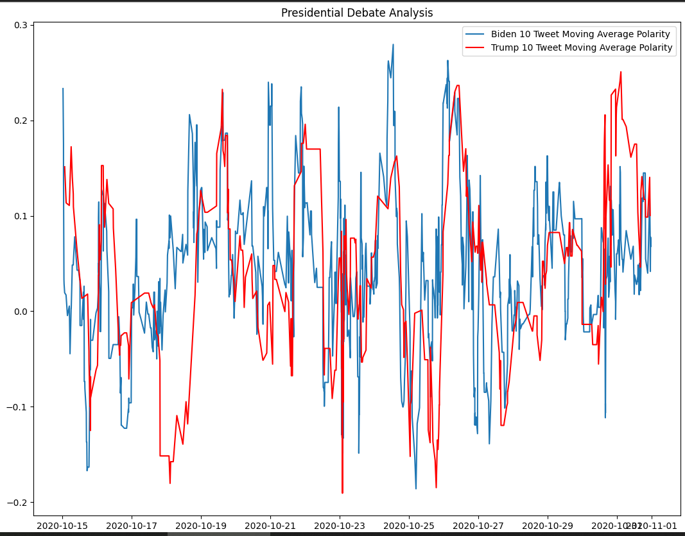

# sentiment_analysis
## Description
Analysis the sentiment from Tweet, on US Election 2020.  
### For the download Dataset code, which be commented out in **main-Copy1.ipynb**:
Finally, I don't have permission to access the X endpoint.  
I guess It's because industry attach importance to the data which they have.  
Another reason may it because My account is free X developer account.  
I also tried the bearer token still not work.  
The error give：  
`TooManyRequests: 429 Too Many Requests `  
https://developer.x.com/en/portal  
Above is the link, I will comment out the code for u.  
Give it a try, text me for discussing.  
**Workaround**:  
I find some dataset from Kaggle, though the data is from 5 years ago,2020.  
https://www.kaggle.com/datasets/manchunhui/us-election-2020-tweets/data  
Let's keep 15 days data.  from oct 15th to oct 31th.  
### For nltk download error:  
Error:  
`[nltk_data] Error loading stopwords: <urlopen error Tunnel connection   `  
`[nltk_data]     failed: 400 Bad Request>     ` 
`[nltk_data] Error loading wordnet: <urlopen error Tunnel connection     ` 
`[nltk_data]     failed: 400 Bad Request>   ` 
Workaround:  
Execute in code line:  
`import nltk  
print(nltk.data.path)  `
Select and open one of the response directory, create a folder called nltk_data  
Download from https://github.com/nltk/nltk_data?tab=readme-ov-file  
Extract only folder corpora to your path nltk_data  
And then you don't need to download stopwords or wordnet components, if u want to use in projects else.  
##  The result:
